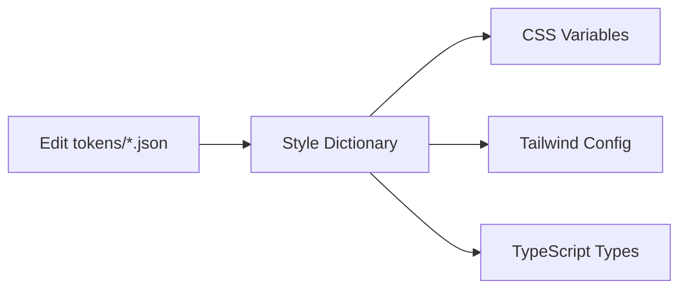

# 🎨 Design System Starter

A production-ready design system monorepo powered by **Turborepo**, featuring automated design tokens, React components, and comprehensive tooling.

## 🚀 Quick Start

```bash
# Install dependencies
pnpm install

# Start development (Storybook + Next.js app)
pnpm dev

# Build everything
pnpm build

# Run tests
pnpm --filter e2e test

# Lint all packages
pnpm lint
```

**What starts with `pnpm dev`:**
- 📖 Storybook → http://localhost:6006
- 🌐 Next.js App → http://localhost:3000

---

## 📦 What's Inside

### Apps

- **`apps/docs`** - Storybook documentation site
- **`apps/web`** - Next.js 15 example app with Server Components
- **`apps/e2e`** - Playwright tests (5 browsers + mobile)

### Packages

- **`packages/design-tokens`** - Style Dictionary token system
  - Generates CSS variables, Tailwind config, TypeScript types
  - Light/dark themes with 124 auto-generated utilities

- **`packages/ui`** - React component library
  - 5 components: Button, Text, Input, Card, Modal
  - Dual exports (ESM + CJS)
  - Full TypeScript support

- **`packages/icons`** - Automated SVG → React pipeline
  - 12 icons with SVGR automation
  - Size and color props

- **`packages/eslint-config`** - Shared ESLint configurations
- **`packages/typescript-config`** - Shared TypeScript configs

---

## 🎨 Design Tokens

### How It Works



### Token Structure

```
tokens/
├── core/              # Primitives (colors, spacing, typography)
│   ├── colors.json
│   ├── spacing.json
│   └── typography.json
└── semantic/          # Theme-specific tokens
    ├── light.json     # Light theme
    └── dark.json      # Dark theme
```

### Changing Tokens

1. **Edit token values:**
   ```json
   // packages/design-tokens/tokens/semantic/light.json
   {
     "colors": {
       "button-primary": {
         "value": "{primitives.colors.purple.500}"
       }
     }
   }
   ```

2. **Rebuild:**
   ```bash
   pnpm --filter design-tokens build
   ```

3. **Verify in app:**
   - Visit http://localhost:3000/tokens-verify
   - All 124 utilities demonstrated live

### Generated Outputs

- **CSS Variables** → `dist/css/tokens.css` (50+ variables)
- **Tailwind Theme** → `dist/css/theme.css`
- **Tailwind Config** → `dist/js/tailwind.config.js`
- **TypeScript Types** → `dist/types/index.ts`

### Token Categories

| Category | Count | Examples |
|----------|-------|----------|
| Colors | 13 tokens | `bg-app`, `text-primary`, `button-primary` |
| Typography | 7 tokens | `font-size-title`, `font-weight-medium` |
| Spacing | 5 tokens | `gap-tiny` (2px) → `gap-xl` (16px) |
| Borders | 2 tokens | `radius-card`, `radius-modal` |
| Shadows | 1 token | `shadow-modal` |

**Result:** 124 auto-generated Tailwind utilities (39 colors + 75 spacing + 7 typography + 3 borders/shadows)

---

## 🧩 Components

### Adding a New Component

1. **Create component file:**
   ```tsx
   // packages/ui/src/badge.tsx
   interface BadgeProps {
     children: React.ReactNode;
     variant?: 'primary' | 'secondary';
   }

   export const Badge = ({ children, variant = 'primary' }: BadgeProps) => {
     return (
       <span className={`px-2 py-1 rounded-card ${variant === 'primary' ? 'bg-badge-active' : 'bg-badge-inactive'}`}>
         {children}
       </span>
     );
   };
   ```

2. **Add to build config:**
   ```ts
   // packages/ui/tsup.config.ts
   export default defineConfig({
     entryPoints: [
       "src/button.tsx",
       "src/text.tsx",
       "src/badge.tsx"  // Add this
     ]
   });
   ```

3. **Export in package.json:**
   ```json
   {
     "exports": {
       "./badge": {
         "types": "./src/badge.tsx",
         "import": "./dist/badge.mjs",
         "require": "./dist/badge.js"
       }
     }
   }
   ```

4. **Build:**
   ```bash
   pnpm --filter ui build
   ```

5. **Use in apps:**
   ```tsx
   import { Badge } from '@repo/ui/badge';

   <Badge variant="primary">New</Badge>
   ```

### Existing Components

| Component | File | Usage |
|-----------|------|-------|
| Button | `button.tsx` | `<Button variant="primary">Click</Button>` |
| Text | `text.tsx` | `<Text as="h1" variant="title">Title</Text>` |
| Input | `input.tsx` | `<Input label="Name" placeholder="Enter name" />` |
| Card | `card.tsx` | `<Card>Content</Card>` |
| Modal | `modal.tsx` | `<Modal isOpen={true} onClose={close}>...</Modal>` |

---

## 🖼️ Icons

### Adding a New Icon

1. **Drop SVG file:**
   ```bash
   # Place your icon SVG in the icons source folder
   cp my-icon.svg packages/icons/src/
   ```

2. **Build icons:**
   ```bash
   pnpm --filter icons build
   ```

   **What happens:**
   - SVGR converts SVG → React component
   - Post-processing fixes colors (replaces with `currentColor`)
   - Adds TypeScript types
   - Generates barrel export in `index.ts`

3. **Use the icon:**
   ```tsx
   import { MyIcon } from '@repo/icons';

   <MyIcon size={24} color="purple" />
   <MyIcon size={16} className="text-primary" />
   ```

### Icon API

```tsx
interface IconProps extends React.SVGProps<SVGSVGElement> {
  size?: number;      // Default: 14
  color?: string;     // Default: 'currentColor'
  className?: string;
}
```

### Available Icons (12)

`AddIcon`, `AssigneeIcon`, `BacklogIcon`, `CanceledIcon`, `CloseIcon`, `DoneIcon`, `ExpandIcon`, `InProgressIcon`, `LabelIcon`, `MoreIcon`, `PriorityIcon`, `TodoIcon`

---

## 🎭 Theme System

### How Themes Work

The system uses CSS custom properties that switch based on the `light` or `dark` class on the `<html>` element.

```css
:root {
  --colors-bg-app: #FFFFFF;
}

.dark {
  --colors-bg-app: #191A23;
}
```

### Changing Theme in Apps

**In Next.js app (`apps/web`):**

1. **ThemeContext** manages state:
   ```tsx
   // apps/web/contexts/ThemeContext.tsx
   const { theme, setTheme } = useTheme();
   ```

2. **ThemeToggle** switches themes:
   ```tsx
   // apps/web/components/ThemeToggle.tsx
   <button onClick={() => setTheme(theme === 'light' ? 'dark' : 'light')}>
     {theme === 'light' ? '🌙' : '☀️'}
   </button>
   ```

3. **Root layout** applies theme:
   ```tsx
   // apps/web/app/layout.tsx
   <html className={theme}>
     <body>...</body>
   </html>
   ```

### Adding a New Theme

1. **Create token file:**
   ```json
   // packages/design-tokens/tokens/semantic/high-contrast.json
   {
     "colors": {
       "bg-app": { "value": "#000000" },
       "text-primary": { "value": "#FFFFFF" }
     }
   }
   ```

2. **Create Style Dictionary config:**
   ```js
   // packages/design-tokens/high-contrast.config.js
   export default {
     source: ["tokens/semantic/high-contrast.json", "tokens/core/**/*.json"],
     platforms: {
       css: {
         transformGroup: "css",
         buildPath: "dist/css/",
         files: [{
           destination: "high-contrast.css",
           format: "css/variables",
           options: { selector: ".high-contrast" }
         }]
       }
     }
   };
   ```

3. **Add to build script:**
   ```json
   // packages/design-tokens/package.json
   {
     "scripts": {
       "build": "style-dictionary build && style-dictionary build --config high-contrast.config.js"
     }
   }
   ```

4. **Import in apps:**
   ```css
   /* apps/web/app/globals.css */
   @import '@repo/design-tokens/tokens.css';
   @import '@repo/design-tokens/high-contrast.css';
   ```

---

## 📖 Storybook Documentation

### Writing Stories

1. **Create story file:**
   ```tsx
   // apps/docs/stories/badge.stories.tsx
   import type { Meta, StoryObj } from '@storybook/react';
   import { Badge } from '@repo/ui/badge';

   const meta: Meta<typeof Badge> = {
     title: 'Components/Badge',
     component: Badge,
     tags: ['autodocs'],
     argTypes: {
       variant: {
         control: 'select',
         options: ['primary', 'secondary']
       }
     }
   };

   export default meta;
   type Story = StoryObj<typeof meta>;

   export const Primary: Story = {
     args: {
       children: 'Badge',
       variant: 'primary'
     }
   };

   export const Secondary: Story = {
     args: {
       children: 'Badge',
       variant: 'secondary'
     }
   };
   ```

2. **View in Storybook:**
   ```bash
   pnpm --filter docs dev
   # Visit http://localhost:6006
   ```

### Story Features

- **Auto-generated docs** from TypeScript prop types
- **Interactive controls** for all props
- **Accessibility testing** with a11y addon
- **Theme toggle** in toolbar
- **Responsive viewports**

### Storybook Configuration

**Main config** (`.storybook/main.js`):
- Auto-finds stories in `stories/*.stories.tsx`
- Vite bundler for instant rebuilds
- Addons: links, essentials, a11y

**Preview config** (`.storybook/preview.tsx`):
- Global theme decorator
- Design token styling
- Custom toolbar controls

---

## 🧪 E2E Tests (Playwright)

### Writing Tests

1. **Create test file:**
   ```ts
   // apps/e2e/tests/new-feature.spec.ts
   import { test, expect } from '@playwright/test';

   test.describe('New Feature', () => {
     test('loads and works correctly', async ({ page }) => {
       await page.goto('/');

       // Find elements using accessible roles
       const heading = page.getByRole('heading', { name: 'My Todos' });
       await expect(heading).toBeVisible();

       // Click button
       const button = page.getByRole('button', { name: 'Create' });
       await button.click();

       // Assert result
       await expect(page.getByText('Success')).toBeVisible();
     });
   });
   ```

2. **Run tests:**
   ```bash
   # Headless mode
   pnpm --filter e2e test

   # Interactive UI
   pnpm --filter e2e test:ui

   # Debug mode
   pnpm --filter e2e test:debug
   ```

### Test Configuration

**Browsers tested:**
- Chromium (Desktop + Mobile Pixel 5)
- Firefox (Desktop)
- WebKit/Safari (Desktop + Mobile iPhone 12)

**Features:**
- Auto-starts Next.js dev server
- Screenshots on failure
- Video recording on failure
- Trace files for debugging

**Key files:**
- `playwright.config.ts` - Test configuration
- `tests/*.spec.ts` - Test files

### Best Practices

```ts
// ✅ Use accessible selectors
page.getByRole('button', { name: 'Submit' })
page.getByLabel('Username')
page.getByText('Welcome')

// ❌ Avoid brittle selectors
page.locator('.submit-btn')
page.locator('#username')
```

---

## 🌐 Using in Your App

### Install Packages

```bash
# In your app's package.json
{
  "dependencies": {
    "@repo/ui": "workspace:*",
    "@repo/icons": "workspace:*",
    "@repo/design-tokens": "workspace:*"
  }
}
```

### Setup Styles

```css
/* app/globals.css */
@import "tailwindcss";
@import "@repo/design-tokens/tokens.css";
@import "@repo/design-tokens/theme.css";

/* Scan UI package for classes */
@source "../../packages/ui/src";
```

### Use Components

```tsx
// app/page.tsx
import { Button } from '@repo/ui/button';
import { Text } from '@repo/ui/text';
import { Card } from '@repo/ui/card';
import { AddIcon } from '@repo/icons';

export default function Page() {
  return (
    <div className="bg-app p-5">
      <Card>
        <Text as="h1" variant="title">My App</Text>
        <Text variant="body" className="text-secondary">
          Using the design system
        </Text>
        <Button variant="primary" leftIcon={<AddIcon />}>
          Create New
        </Button>
      </Card>
    </div>
  );
}
```

### Theme Provider Setup

```tsx
// app/layout.tsx
import { ThemeProvider } from './contexts/ThemeContext';

export default function RootLayout({ children }) {
  return (
    <html suppressHydrationWarning>
      <body>
        <ThemeProvider>
          {children}
        </ThemeProvider>
      </body>
    </html>
  );
}
```

```tsx
// contexts/ThemeContext.tsx
'use client';

import { createContext, useContext, useEffect, useState } from 'react';

type Theme = 'light' | 'dark';

const ThemeContext = createContext<{
  theme: Theme;
  setTheme: (theme: Theme) => void;
}>({ theme: 'light', setTheme: () => {} });

export const ThemeProvider = ({ children }) => {
  const [theme, setTheme] = useState<Theme>('light');

  useEffect(() => {
    const stored = localStorage.getItem('theme') as Theme;
    if (stored) setTheme(stored);
  }, []);

  useEffect(() => {
    document.documentElement.className = theme;
    localStorage.setItem('theme', theme);
  }, [theme]);

  return (
    <ThemeContext.Provider value={{ theme, setTheme }}>
      {children}
    </ThemeContext.Provider>
  );
};

export const useTheme = () => useContext(ThemeContext);
```

---

## 📦 Versioning & Publishing

### Using Changesets

This repo uses [Changesets](https://github.com/changesets/changesets) for version management.

**1. Make changes to packages**

**2. Create changeset:**
```bash
pnpm changeset
```

Interactive prompts will ask:
- Which packages changed?
- Semver bump type? (major/minor/patch)
- Summary of changes?

This creates a file in `.changeset/` folder.

**3. Version packages:**
```bash
pnpm version-packages
```

This:
- Updates package.json versions
- Updates CHANGELOG.md files
- Removes changeset files

**4. Publish to npm:**
```bash
pnpm release
```

This:
- Builds all packages
- Publishes to npm registry

### Publishing Configuration

**In package.json:**
```json
{
  "name": "@your-org/ui",
  "publishConfig": {
    "access": "public"
  }
}
```

**Remove `publishConfig` for private packages**

### GitHub Actions (CI/CD)

The repo includes a GitHub Action that:
1. Runs on every push
2. Builds all packages
3. Runs tests
4. Creates "Version Packages" PR automatically
5. Publishes when PR is merged

**Required secrets:**
- `NPM_TOKEN` - npm authentication
- `GITHUB_TOKEN` - GitHub API access

---

## 🛠️ Common Tasks

### Add Package Dependency

```bash
# To specific package
pnpm --filter @repo/ui add react-query

# To workspace root
pnpm add -w typescript

# To all packages
pnpm add -r prettier
```

### Build Specific Package

```bash
pnpm --filter design-tokens build
pnpm --filter ui build
pnpm --filter icons build
```

### Clean Everything

```bash
pnpm clean
```

Removes all:
- `node_modules/`
- `dist/` folders
- `.next/` cache
- Storybook cache

### Typecheck

```bash
pnpm typecheck
```

### Format Code

```bash
pnpm format
```

---

## 🏗️ Architecture

```
┌─────────────────────────────────────────────────┐
│  design-tokens (Style Dictionary)               │
│  ├─ tokens.css (CSS variables)                  │
│  ├─ theme.css (Tailwind theme)                  │
│  └─ tailwind.config.js                          │
└────────────────┬────────────────────────────────┘
                 │
        ┌────────┴────────┐
        │                 │
┌───────▼────────┐  ┌────▼──────────┐
│  ui            │  │  icons        │
│  (Components)  │  │  (SVG → TSX)  │
└───────┬────────┘  └────┬──────────┘
        │                │
        └────────┬───────┘
                 │
        ┌────────┴────────┐
        │                 │
   ┌────▼─────┐    ┌─────▼──────┐
   │   web    │    │    docs    │
   │ (Next.js)│    │ (Storybook)│
   └──────────┘    └────────────┘
```

**Build Order:**
1. `design-tokens` builds first (no dependencies)
2. `icons` builds (no dependencies)
3. `ui` builds (depends on tokens, icons)
4. `web` and `docs` build (depend on ui, tokens, icons)

**Turborepo** handles this automatically with caching.

---

## 📚 Key Files

| File | Purpose |
|------|---------|
| `turbo.json` | Turborepo task configuration |
| `pnpm-workspace.yaml` | Workspace packages definition |
| `.changeset/config.json` | Changesets configuration |
| `packages/ui/tsup.config.ts` | UI build configuration |
| `packages/design-tokens/light.config.js` | Light theme tokens |
| `packages/design-tokens/dark.config.js` | Dark theme tokens |
| `apps/docs/.storybook/main.js` | Storybook configuration |
| `apps/e2e/playwright.config.ts` | Playwright configuration |

---

## 🤝 Contributing

1. Fork and clone the repo
2. Install dependencies: `pnpm install`
3. Create a branch: `git checkout -b feature/my-feature`
4. Make changes and test: `pnpm dev`, `pnpm build`, `pnpm lint`
5. Commit: `git commit -m "feat: add new feature"`
6. Push and create PR

---

## 📄 License

MIT

---

## 🔗 Useful Links

- [Turborepo Docs](https://turbo.build/repo/docs)
- [Style Dictionary Docs](https://amzn.github.io/style-dictionary/)
- [Storybook Docs](https://storybook.js.org/docs)
- [Playwright Docs](https://playwright.dev/)
- [Changesets Docs](https://github.com/changesets/changesets)
