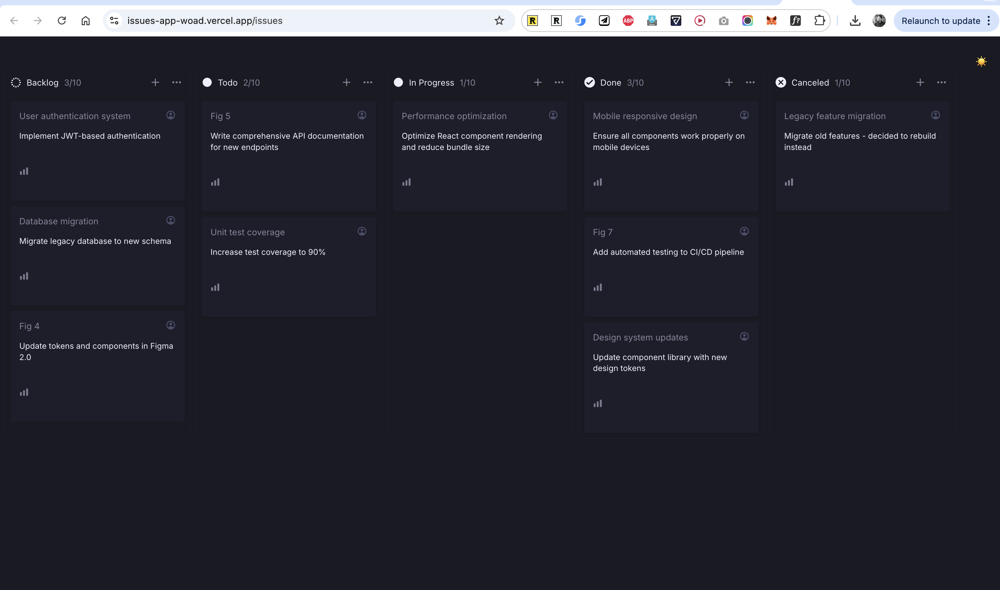
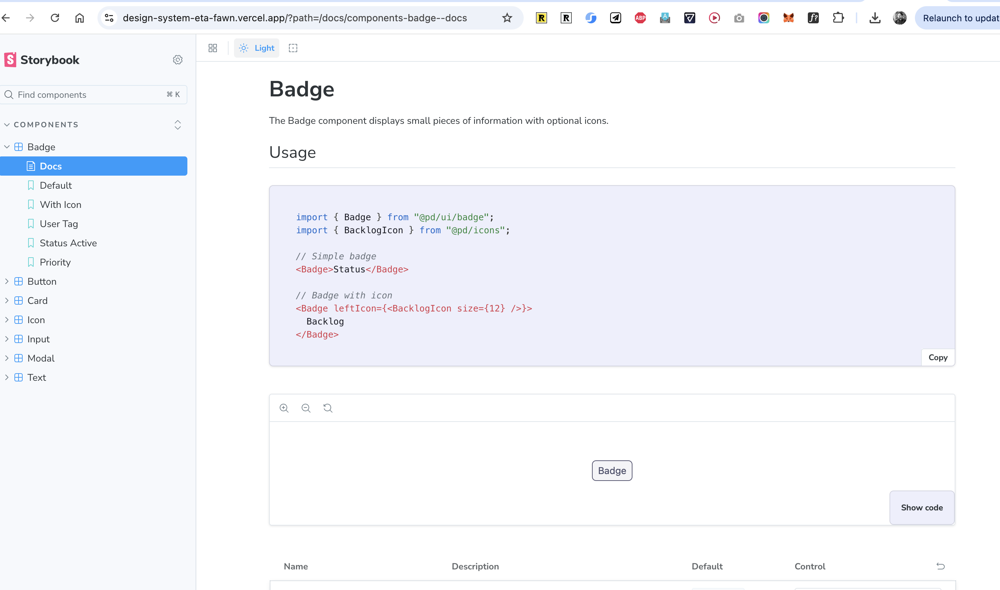
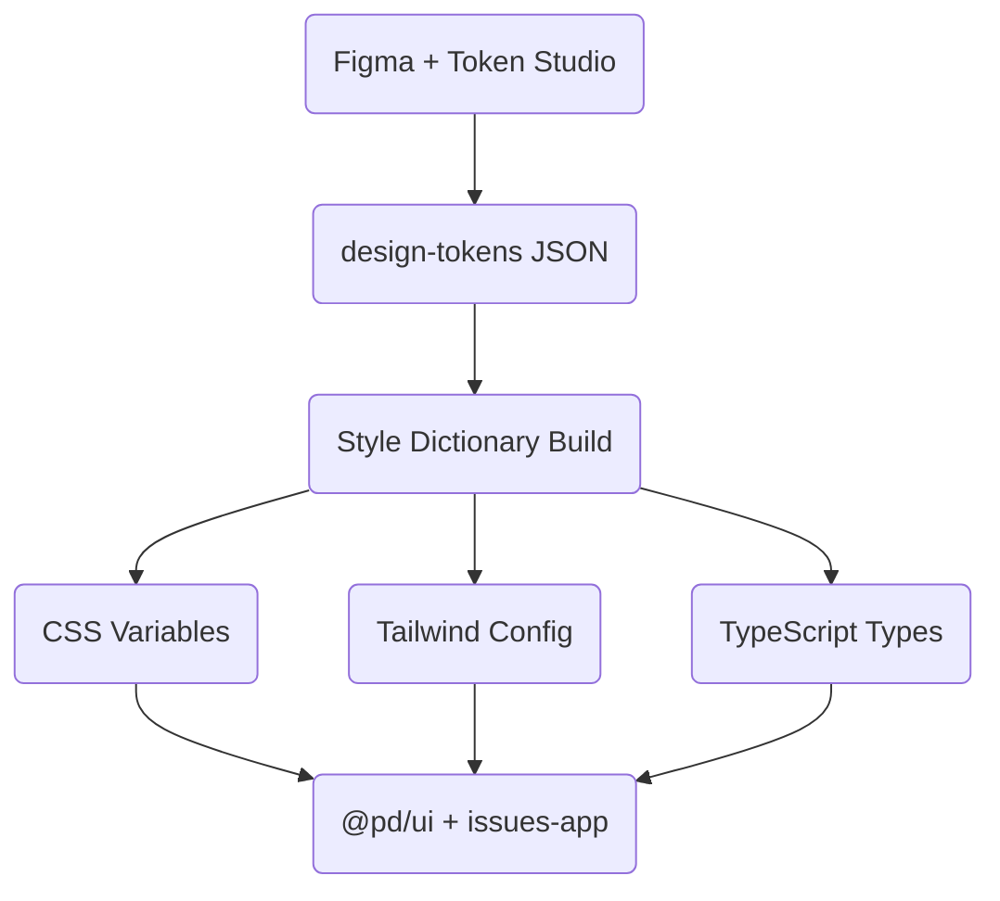

# Design System & Issues Tracker

This repository demonstrates a **design system + product app integration** using a monorepo architecture.  
It contains:  
- A **design system** (tokens, themes, components, icons, docs).  
- An **issues tracker app** (Kanban board) built with **Next.js 15 + React 19**, consuming the design system directly.  

The goal is to show a **token-first workflow** from **Figma → code**, with automated documentation, theming, and testing for production-grade scalability.  

---

## 🚀 Quick Start

```bash
# Install dependencies
pnpm install

# Start all apps in development
pnpm dev

# Open Storybook
pnpm --filter docs dev

# Run the Issues App (Next.js Kanban board)
pnpm --filter issues-app dev

# Run E2E tests
cd apps/e2e && pnpm test
```

---

## 📂 Project Structure

```
design-system/
├── apps/
│   ├── docs/              # Storybook documentation site
│   ├── e2e/               # Playwright end-to-end tests
│   └── issues-app/        # Next.js kanban board application
├── packages/
│   ├── design-tokens/     # Style Dictionary design tokens
│   ├── eslint-config/     # Shared ESLint configurations
│   ├── icons/             # Automated SVG → React icon generation
│   ├── typescript-config/ # Shared TypeScript configurations
│   └── ui/                # React component library
└── turbo.json             # Turborepo build orchestration
```

Naming convention:  
- `@pd/ui` → UI components  
- `@pd/icons` → icons  
- `@pd/design-tokens` → design tokens  

---

## 📸 Screenshots

> Replace these placeholders with real screenshots/GIFs.

- **Kanban Board UI**  
  

- **Storybook Docs**  
  

---

## ❓ Why Monorepo?

A monorepo approach was chosen for several key benefits:  
- **Single Source of Truth** → shared tokens, UI components, and configs.  
- **Atomic Changes** → update a token or component and all apps reflect it instantly.  
- **Consistent Tooling** → unified linting, testing, build pipelines.  
- **Simplified Releases** → coordinated versioning across apps/packages.  
- **Better DX** → one clone, one install, everything works together.  

---

## ❓ Why Style Dictionary?

Style Dictionary was selected as the **token compiler** because it:  
- **Supports Multi-Platform Outputs** → CSS vars, Tailwind config, TS types, JSON.  
- **Keeps Tokens Source-Agnostic** → design tokens exported from Figma once, reused everywhere.  
- **Automates Theming** → light/dark variations with zero manual duplication.  
- **Future Proof** → if we add React Native or another platform, we just add a new output format.  

Without Style Dictionary, we’d be **copy-pasting values** into multiple formats, increasing drift and errors.  

---

## 🎨 Design Token Strategy

The system is built on a **token-first approach** using **Style Dictionary**.  

### Flow: From Figma → Code



### Token Layers
- **Core Tokens** → raw values (colors, spacing, typography, shadows).  
- **Semantic Tokens** → context-aware (primary-bg, text-heading, border-muted).  
- **Themes** → light/dark overrides via CSS variables.  

### Distribution
- CSS Custom Properties → runtime theming.
- Tailwind Config → utility-first styling.
- TypeScript Definitions → type-safe usage in components.

### Generated Tailwind Utilities

Our design tokens automatically generate **124 Tailwind utility classes** through a custom build pipeline:

**Total Calculation**: 39 (colors) + 75 (spacing) + 7 (typography) + 3 (borders & shadows) = **124 utility classes**

**🎨 Color Utilities** (39 classes)
- 13 unique color tokens × 3 variants (`bg-*`, `text-*`, `border-*`) = **39 utility classes**
- Skips `border-*` and `button-*` semantic tokens to avoid duplicates

**The 13 Color Tokens:**
1. `app` → `bg-app`, `text-app`, `border-app`
2. `modal` → `bg-modal`, `text-modal`, `border-modal`
3. `card` → `bg-card`, `text-card`, `border-card`
4. `badge` → `bg-badge`, `text-badge`, `border-badge`
5. `primary` → `bg-primary`, `text-primary`, `border-primary`
6. `secondary` → `bg-secondary`, `text-secondary`, `border-secondary`
7. `tertiary` → `bg-tertiary`, `text-tertiary`, `border-tertiary`
8. `muted` → `bg-muted`, `text-muted`, `border-muted`
9. `badge-active` → `bg-badge-active`, `text-badge-active`, `border-badge-active`
10. `badge-inactive` → `bg-badge-inactive`, `text-badge-inactive`, `border-badge-inactive`
11. `placeholder` → `bg-placeholder`, `text-placeholder`, `border-placeholder`
12. `modal-header` → `bg-modal-header`, `text-modal-header`, `border-modal-header`
13. `modal-shadow` → `bg-modal-shadow`, `text-modal-shadow`, `border-modal-shadow`

| Sample Utilities | Light Mode | Dark Mode | Usage |
|-----------------|-----------|-----------|-------|
| `bg-app` / `text-app` / `border-app` | `#FFFFFF` | `#191A23` | `<div className="bg-app text-primary">` |
| `bg-badge` / `text-badge` / `border-badge` | `#D2D3E0` | `#595974` | `<span className="bg-badge">` |
| `bg-primary` / `text-primary` / `border-primary` | `#191A23` | `#EEEFFC` | `<h1 className="text-primary">` |
| `text-secondary` / `text-tertiary` / `text-muted` | Various grays | Various grays | `<p className="text-secondary">` |

**📏 Spacing Utilities** (75 classes)
- 5 spacing tokens × 15 variants (p, px, py, pt, pr, pb, pl, m, mx, my, mt, mr, mb, ml, gap) = **75 utility classes**

| Token | Value | Generated Classes | Example |
|-------|-------|------------------|---------|
| `--spacing-1` | `2px` | `p-1`, `m-1`, `gap-1`, `px-1`, `mt-1`, etc. | `<div className="p-1">` |
| `--spacing-2` | `6px` | `p-2`, `m-2`, `gap-2`, `px-2`, `mt-2`, etc. | `<div className="px-2 py-3">` |
| `--spacing-3` | `8px` | `p-3`, `m-3`, `gap-3`, etc. | `<div className="gap-3">` |
| `--spacing-4` | `12px` | `p-4`, `m-4`, `gap-4`, etc. | `<div className="m-4">` |
| `--spacing-5` | `16px` | `p-5`, `m-5`, `gap-5`, etc. | `<div className="p-5">` |

**✍️ Typography Utilities** (7 classes)
- 3 font-size + 2 font-weight + 2 font-family = **7 utility classes**

| Utility | Value | Usage |
|---------|-------|-------|
| `text-title` | `18px` | `<h1 className="text-title">` |
| `text-body` | `13px` | `<p className="text-body">` |
| `text-small` | `12px` | `<span className="text-small">` |
| `font-regular` | `400` | `<p className="font-regular">` |
| `font-medium` | `500` | `<span className="font-medium">` |
| `font-primary` | `Inter` | `<body className="font-primary">` |
| `font-secondary` | `Geist` | `<code className="font-secondary">` |

**🔲 Border & Shadow Utilities** (3 classes)
- 2 border-radius + 1 shadow = **3 utility classes**

| Utility | Value | Usage |
|---------|-------|-------|
| `rounded-card` | `4px` | `<div className="rounded-card">` |
| `rounded-modal` | `8px` | `<div className="rounded-modal">` |
| `shadow-modal` | `0px 16px 80px rgba(0,0,0,0.5)` | `<div className="shadow-modal">` |

**Example Component:**
```jsx
<div className="bg-card rounded-card p-4 shadow-modal">
  <h2 className="text-title font-medium text-primary mb-2">Card Title</h2>
  <p className="text-body text-secondary">Description text</p>
  <div className="flex gap-2 mt-3">
    <span className="bg-badge text-badge-active px-2 py-1 rounded-card text-small">
      Tag
    </span>
  </div>
</div>
```

> **📚 Full Reference**: See [design-token-final.mdx](design-token-final.mdx) for complete utility class documentation.

---

## 🧩 UI Components (`@pd/ui`)

Production-ready React components:  
- **Badge** – status indicators  
- **Button** – multiple variants & states  
- **Card** – container component  
- **Input** – form fields with validation  
- **Modal** – dialogs with focus trapping  
- **Text** – semantic typography  

All built with:  
- TypeScript for type safety  
- Tailwind CSS for styling  
- WCAG 2.1 AA accessibility baked in  
- Storybook for documentation  

---

## 📖 Storybook

Interactive documentation with:  
- Live playgrounds  
- Auto-generated prop tables  
- A11y addon for compliance  
- Responsive viewport testing  
- Theme toggle (light/dark)  

Run at `localhost:6006` during development.  

---

## 🎨 Theming System

- **CSS Custom Properties** for instant runtime theme switching.  
- **React Context** for theme state.  
- **Tailwind Integration** so all utilities are token-driven.  

---

## ♿ Accessibility Features

- **Focus management** (custom focus rings, modal focus trapping).  
- **ARIA roles + states** for screen readers.  
- **Keyboard navigation** (arrow keys, Enter/Space, Escape dismissal).  
- **Testing** via Storybook a11y addon + Playwright axe checks.  

---

## 🧪 End-to-End Testing

Playwright ensures Kanban functionality works across browsers.  

✔ Create, update, and move cards.  
✔ Modal open/close (click, cancel, escape).  
✔ Cross-column drag-and-drop.  
✔ Card count consistency.  

**Example Test**  
```ts
test("creates a new card", async ({ page }) => {
  await page.getByRole("button", { name: "New Issue" }).click();
  await page.fill("input[name=title]", "Fix login bug");
  await page.click("button[type=submit]");
  await expect(page.getByText("Fix login bug")).toBeVisible();
});
```

---

## 🔒 Branch Protection & CI/CD

- **Branch Protection** → no direct pushes to `main`.  
- **Status Checks** → build, lint, test, type-check required.  
- **CI/CD** → GitHub Actions (build + test + deploy).  

---

## 🗂 Issues App (Next.js 15 + React 19)

A Kanban board app demonstrating design system integration.  

### Features
- Create New Issue modal  
- Update Issue modal  
- Smooth drag-and-drop  
- Modal focus + escape handling  
- Suspense for skeleton loading  

### Server Actions
- Direct form → server function (no API routes).  
- Fully type-safe, smaller client bundles, better perf.  

---

## ⚙️ Tech Stack

- **Monorepo**: Turborepo + pnpm  
- **Frontend**: Next.js 15 + React 19 + TypeScript  
- **Styling**: Tailwind CSS + CSS Vars  
- **Design Tokens**: Style Dictionary  
- **Docs**: Storybook  
- **Testing**: Playwright + Jest  
- **Build**: tsup + Turbopack  
- **CI/CD**: GitHub Actions  

---


